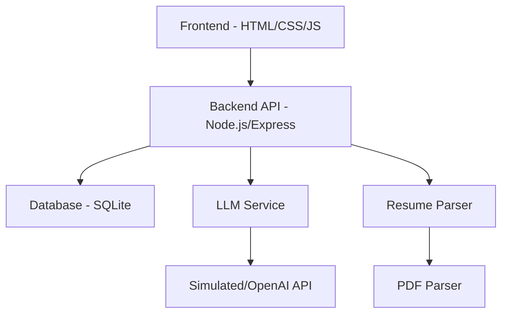

# Smart Resume Screener

An intelligent resume screening tool that parses resumes, extracts skills, and matches them with job descriptions using LLM technology.

## Table of Contents
- [Features](#features)
- [Architecture](#architecture)
- [LLM Integration](#llm-integration)
- [API Endpoints](#api-endpoints)
- [Database Schema](#database-schema)
- [Setup Instructions](#setup-instructions)
- [Usage](#usage)
- [Deployment to GitHub](#deployment-to-github)
- [File Structure](#file-structure)
- [Dependencies](#dependencies)
- [License](#license)

## Features

- Resume upload (PDF or text)
- Automatic skill extraction
- Job description input
- LLM-powered semantic matching
- Match scoring and justification
- Responsive single-page design
- Database storage for resumes, jobs, and matches
- RESTful API for integration

## Architecture



### Components

1. **Frontend**: Single HTML file with embedded CSS and JavaScript
   - Drag & drop resume upload
   - Text area for resume input
   - Job description input
   - Results display

2. **Backend API**: Node.js/Express server
   - Resume upload endpoint
   - Job management endpoints
   - Match creation and retrieval
   - Health check endpoint

3. **Database**: SQLite with three main tables
   - Resumes: Stores parsed resume data
   - Jobs: Stores job descriptions
   - Matches: Stores match results

4. **Services**:
   - Resume Parser: Extracts text and skills from resumes
   - LLM Service: Performs semantic matching (simulated or real)
   - PDF Parser: Extracts text from PDF files
## VIDEO DEMO 
  - https://drive.google.com/file/d/19TaKKVTYVFP_ue6AvtKlSrnL27aIWESj/view?usp=drive_link
## LLM Integration

The Smart Resume Screener uses LLM technology for semantic matching between resumes and job descriptions.

### Current Implementation

The application currently uses a **simulated LLM** for demonstration purposes. This simulation:
- Extracts skills from both resume and job description
- Calculates match percentage based on skills overlap
- Generates justifications based on match scores
- Provides matching skills list

### Connecting a Real LLM

To connect to a real LLM (like OpenAI's GPT):

1. Set your API key as an environment variable:
   ```bash
   export OPENAI_API_KEY=your_openai_api_key_here
   ```

2. Enable real LLM usage:
   ```bash
   export USE_REAL_LLM=true
   ```

3. Restart the server

### LLM Prompts

The application uses the following prompt template for real LLM integration:

```
Analyze the match between this candidate's resume and the job description.

Candidate Resume:
Skills: {resume_skills}
Experience: {resume_experience}
Education: {resume_education}

Job Description:
{job_description}

Please provide:
1. A match score from 1-10 (where 10 is a perfect match)
2. A brief justification explaining the score (2-3 sentences)
3. A list of matching skills

Respond in JSON format:
{
  "score": number,
  "justification": string,
  "matchingSkills": string[]
}
```

### Example LLM Response

```json
{
  "score": 8,
  "justification": "Strong match with extensive experience in required technologies. The candidate has 5 years of React experience which exceeds the job requirement. Minor gaps in cloud platform experience.",
  "matchingSkills": ["JavaScript", "React", "Node.js", "HTML", "CSS"]
}
```

## API Endpoints

### Health Check
- `GET /api/health` - Server health status

### Resume Management
- `POST /api/resumes/upload` - Upload and parse a resume
  - Form data: `resume` (file)
  - Response: Parsed resume data with ID

### Job Management
- `POST /api/jobs` - Create a new job description
  - JSON body: `{ title: string, description: string }`
  - Response: Created job with ID

### Match Management
- `POST /api/match` - Create a match between resume and job
  - JSON body: `{ resumeId: number, jobId: number }`
  - Response: Match result with score and justification
- `GET /api/matches/job/:jobId` - Get all matches for a specific job
  - Response: Array of matches sorted by score

## Database Schema

### Resumes Table
```sql
CREATE TABLE resumes (
  id INTEGER PRIMARY KEY AUTOINCREMENT,
  name TEXT,
  email TEXT,
  phone TEXT,
  skills TEXT,  -- JSON array
  experience TEXT,
  education TEXT,
  parsed_data TEXT,  -- Full JSON data
  created_at DATETIME DEFAULT CURRENT_TIMESTAMP
);
```

### Jobs Table
```sql
CREATE TABLE jobs (
  id INTEGER PRIMARY KEY AUTOINCREMENT,
  title TEXT,
  description TEXT,
  created_at DATETIME DEFAULT CURRENT_TIMESTAMP
);
```

### Matches Table
```sql
CREATE TABLE matches (
  id INTEGER PRIMARY KEY AUTOINCREMENT,
  resume_id INTEGER,
  job_id INTEGER,
  score INTEGER,
  justification TEXT,
  matching_skills TEXT,  -- JSON array
  created_at DATETIME DEFAULT CURRENT_TIMESTAMP,
  FOREIGN KEY (resume_id) REFERENCES resumes (id),
  FOREIGN KEY (job_id) REFERENCES jobs (id)
);
```

## Setup Instructions

1. Install dependencies:
   ```bash
   npm install
   ```

2. Start the backend server:
   ```bash
   npm start
   ```

3. Open `smart_resume_screener.html` in your browser

## Usage

1. Upload a resume file (PDF or TXT) or paste resume text
2. Enter a job description
3. Click "Analyze Match" to see the results
4. View match score, justification, and matching skills

## File Structure

```
Smart Resume Scanner/
├── smart_resume_screener.html   # Main application interface
├── sample_resume.txt            # Sample resume for testing
├── test_resume.txt              # Another sample resume
├── database.sqlite              # Database file
├── README.md                    # This file
├── server.js                    # Main server file
└── backend/                     # Backend API files
    ├── models/                  # Database models
    │   ├── Resume.js            # Resume model
    │   ├── Job.js               # Job model
    │   └── Match.js             # Match model
    ├── routes/                  # API routes
    │   ├── resumeRoutes.js      # Resume routes
    │   ├── jobRoutes.js         # Job routes
    │   └── matchRoutes.js       # Match routes
    ├── services/                # Business logic
    │   ├── resumeService.js     # Resume parsing service
    │   └── llmService.js        # LLM service
    ├── utils/                   # Utility functions
    │   └── fileUtils.js         # File utilities
    └── database/                # Database setup
        └── db.js                # Database initialization
```

## Dependencies

- express - Web framework
- multer - File upload handling
- pdf-parse - PDF text extraction
- sqlite3 - Database
- openai - OpenAI API client (for real LLM integration)

## License

MIT

## Deployment to GitHub

This project is ready to be deployed to GitHub. Follow these steps:

1. **Create a GitHub Repository**
   - Go to [https://github.com](https://github.com) and log in to your account
   - Click the "+" icon in the top right corner and select "New repository"
   - Name your repository: `smart-resume-screener`
   - Set visibility to "Public" (or "Private" if you prefer)
   - **Do NOT initialize the repository with a README, .gitignore, or license**
   - Click "Create repository"

2. **Push Your Code to GitHub**
   After creating the repository, push your local code to GitHub:
   ```bash
   cd "c:\Users\PIYUSH TORAWANE\Smart resume scanner"
   git remote add origin https://github.com/piyushtorawane/smart-resume-screener.git
   git branch -M main
   git push -u origin main
   ```

3. **Verify the Push**
   After running the commands, refresh your GitHub repository page. You should see all your files uploaded.

For detailed deployment instructions, see [GITHUB_DEPLOYMENT_INSTRUCTIONS.md](GITHUB_DEPLOYMENT_INSTRUCTIONS.md) which includes troubleshooting tips and next steps.
